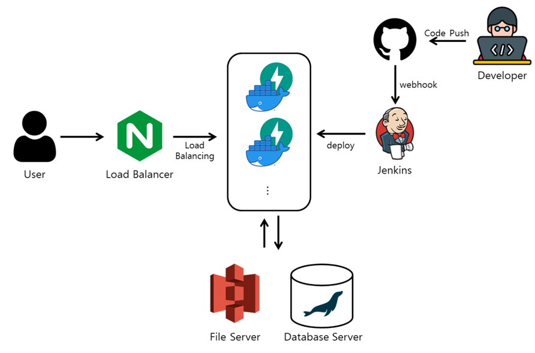
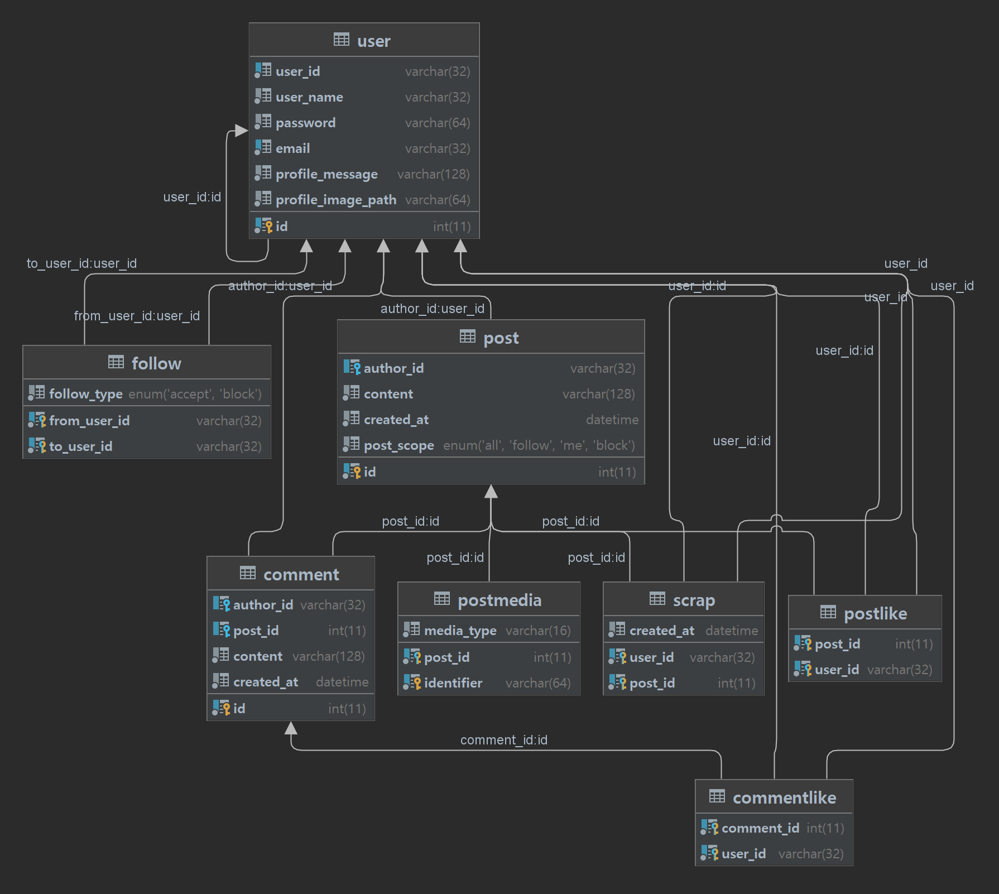

# NSN

## 개요

- 인스타그램을 모방한 SNS의 백엔드/프론트엔드를 직접 구현
- 기능 구현에 그치지 않고 성능, 확장성, 유지보수성 고려
- 클라우드 서버에 배포 실습
- frontend : [github 링크](https://github.com/wocks1123/NSN_front)

## 사용 기술

- fastapi, sqlalchemy, mariadb, docker, ubuntu, jenkins 

## 주요기능

- 포스트 작성
- 이미지 업로드
- 로그인 및 인증
- 유저 검색
- 팔로워/팔로잉 추가
- 댓글
- 좋아요
- 스크랩

## Use Case

- [Wiki](https://github.com/wocks1123/NSN/wiki/Use-Case)

## Business Logic

- [Wiki](https://github.com/wocks1123/NSN/wiki/Business-Logic)

## 구조도

- nginx로 로드밸런싱
- jenkins 서버로 CI/CD

## ERD

## 배포 서버

[링크](http://115.85.183.220/)로 접속할 수 있습니다.
